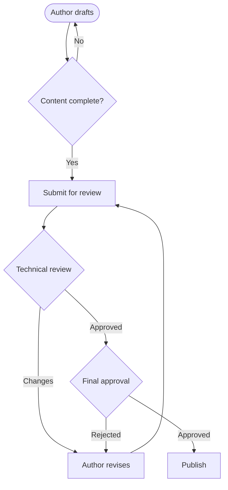

# How I Work

A short tour of how I think about documentation as a governed system — the methods behind the documents in the showcase. This complements my resume rather than repeating it.

## Documentation governance

I treat documents as **controlled assets**, applying ISO 9001:2015 document-control discipline to operational content. Every controlled document has a unique identifier, a named owner, a version history, an audience and sensitivity classification, a defined review cycle, and a lifecycle state. The goal is that anyone can answer, for any document: *Is this current? Who owns it? When was it last reviewed?* A governed system is audit-ready by default — when someone asks "how do you know this is correct?", the system answers with evidence rather than hope.

## Knowledge base architecture

A knowledge base is an information architecture, not a folder of articles. I design around **predictable typing** (each article type has an expected structure), **consistent identification** (names that describe an article's place in the system), **deliberate classification** (audience plus TLP sensitivity as structural metadata), and **single-sourcing** (one authoritative article per topic, no duplicates to drift apart). The structure — not heroic manual effort — is what keeps the KB trustworthy as it scales.

## Classification with TLP

I use the **Traffic Light Protocol** (TLP:RED / AMBER / GREEN / CLEAR) to make sharing boundaries unambiguous. Its value comes entirely from everyone agreeing on the definitions in advance: a single label communicates exactly who may see a document. Treating classification as enforceable metadata — not a note in the body — is what lets it actually protect information.

## Process modeling

I map workflows to expose handoffs, decision points, and bottlenecks. Authoring diagrams as **text (Mermaid)** rather than in a drawing tool means they're version-controlled, diff-able, and single-sourced with the documentation they describe. A document review and approval flow, for example:

The feedback loops are the point — they make explicit that rejection at either stage returns work to the author, the kind of detail prose tends to blur.

## Migrations and consolidation

I lead documentation migrations as **consolidation and governance initiatives, not file transfers**. The decisive move is designing the target architecture — types, naming, classification, lifecycle — *before* moving anything, so the destination is structured, deduplicated, and governed from day one rather than inheriting the disorder of the old system.

## Technical & API documentation

Beyond governed operational docs, I produce developer-facing reference material — endpoint documentation, request/response examples, and structured API references — applying the same standards of clarity and consistency to technical content.
