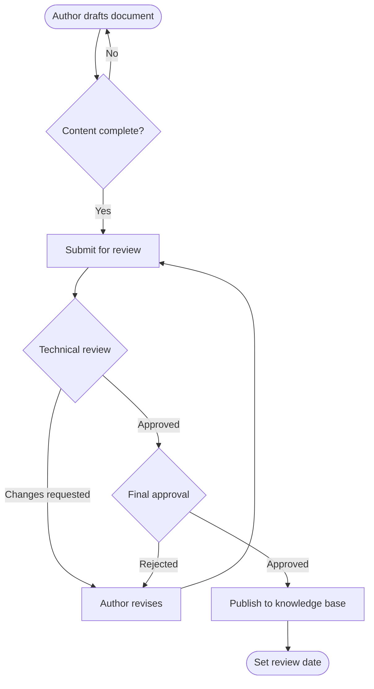
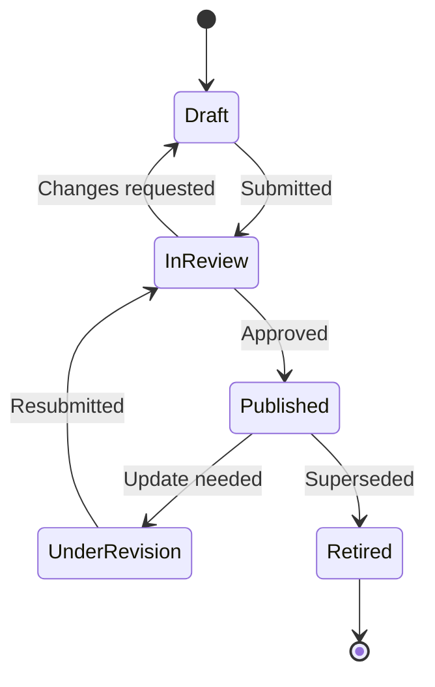

# Process Flow Diagrams

Process modeling turns an operation that lives in people's heads into something a whole team can see, question, and improve. I map workflows to expose handoffs, decision points, and bottlenecks — and to give documentation a visual backbone that prose alone can't provide.

The diagrams below are authored in **Mermaid**, a text-based diagramming syntax. Because they're written as code, they're version-controlled and editable alongside the documentation itself — no binary diagram files to fall out of sync.

!!! note "Background"
    These are representative workflows illustrating process-modeling technique. They contain no confidential or client-specific detail.

## Document review and approval workflow

A controlled document moves through defined states before it becomes authoritative. This flow shows the path from authoring to publication, including the rejection loop:

The two feedback loops are the point of the diagram: they make explicit that rejection at either stage returns work to the author, which is exactly the governance detail a prose description tends to blur.

## Document lifecycle states

Process flows show *movement*; state diagrams show *status*. This one models the lifecycle states a governed document occupies over its life:

Note that **Retired** leads to an archived end state, not deletion — preserving the audit trail, consistent with ISO document-control principles.

## Why model in text

Authoring diagrams as code rather than in a drawing tool delivers three governance benefits: diagrams are **version-controlled** (every change tracked in Git), **diff-able** (reviewers see exactly what changed), and **single-sourced** (the diagram lives with the document it describes, so the two can't drift apart). It's the same docs-as-code discipline applied to visuals.
